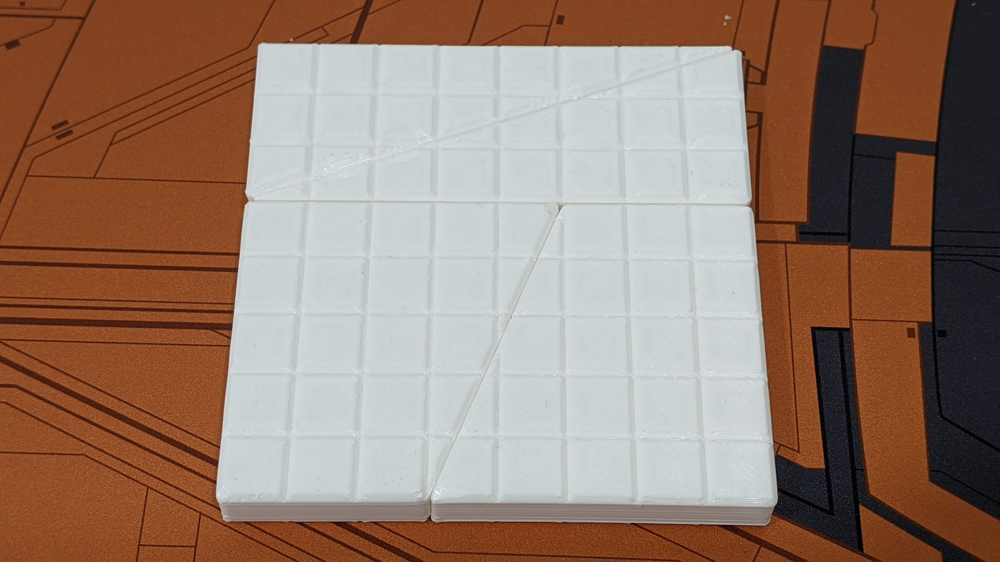
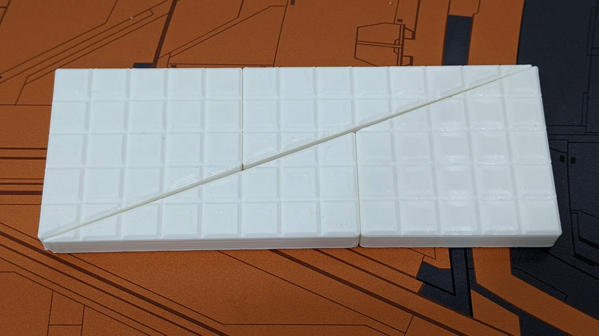

# Model

> From new to old.

## Chessboard Paradox

* Download(Four-part assembly): [Chessboard_paradox.stl](Chessboard_paradox.stl)
* Download: [Chessboard_paradox_trapezoid.stl](Chessboard_paradox_trapezoid.stl)
* Download: [Chessboard_paradox_triangle.stl](Chessboard_paradox_triangle.stl)
* Explain: Chessboard paradox is a falsidical paradox based on an optical illusion. (Wiki: [https://en.wikipedia.org/wiki/Chessboard_paradox](https://en.wikipedia.org/wiki/Chessboard_paradox))

## IKEA Sucker kit

### Prototype hook

* Download: [IKEA_Prototype_hook.stl](IKEA_Prototype_hook.stl)
* Explain: IKEA Prototype hook

### Scrub Sponge Caddy

* Download: [IKEA_Sponge_Caddy.stl](IKEA_Sponge_Caddy.stl)
* Explain: 2 in 1 Scrub Sponge Caddy

## Ender 3 v2 Cover

* Download: [Ender_3_v2_cover.stl](Ender_3_v2_cover.stl)
* Explain: Better heat dissipation cover

## Piyopiyo Triangular Prism Toy

* Download: [Piyopiyo_Triangular_Prism.stl](Piyopiyo_Triangular_Prism.stl)
* Explain: Piyopiyo Triangular Prism Toy

## XYZ Cube

* Download: [xyz.stl](xyz.stl)
* Explain: Calibration block

## Combi Baby Bottle Adapter Converter

* Download: [baby_bottle_adapter_converter.stl](baby_bottle_adapter_converter.stl)
* Explain: Bottle Adapter Converter From Combi Standard Neck To Wide Neck

## Magnetic Catch

* Download: [magnetic_catch.stl](magnetic_catch.stl)
* Article: [http://blog.qqboxy.com/2020/04/3d.html](http://blog.qqboxy.com/2020/04/3d.html)
