# Model

> From new to old.

## Shovel
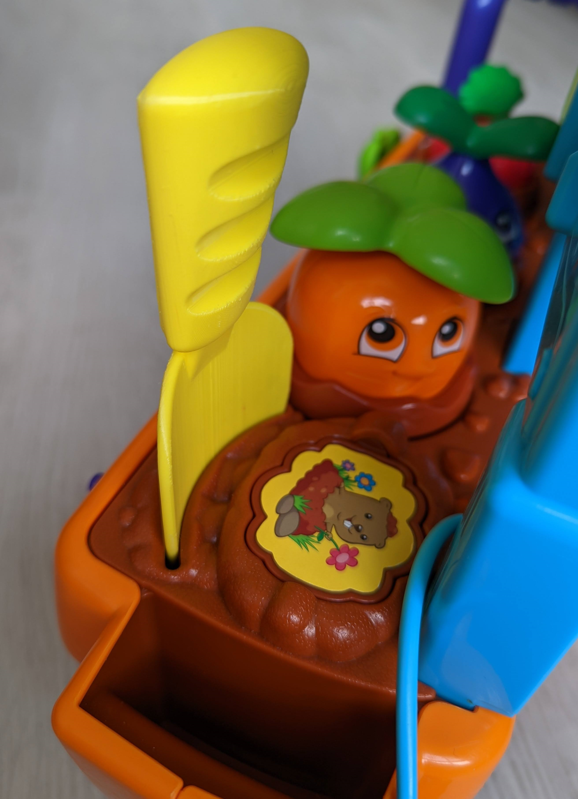 
* Download: [Shovel.stl](Shovel.stl)
* Explain: Shovel for Water & Count Vegetable Garden.

## Faucet Extender
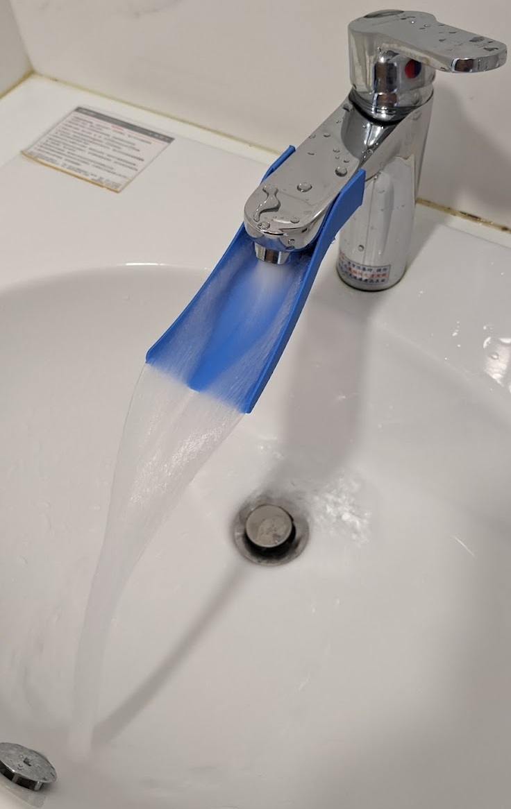 
* Download: [Faucet_Extender.stl](Faucet_Extender.stl)
* Explain: Faucet extender for Children hand washing

## Retro Telephone
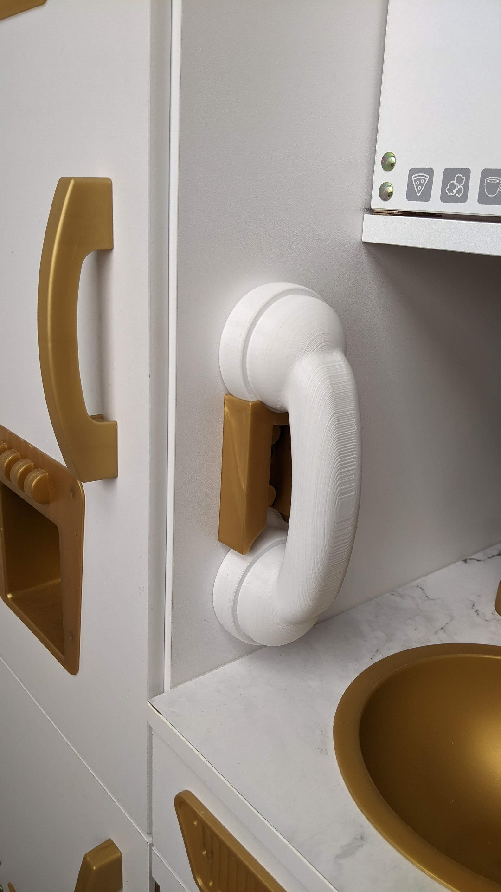 
* Download: [Retro_Telephone.stl](Retro_Telephone.stl)
* Explain: Retro Telephone for KidKraft Vintage Wooden Play Kitchen.

## Water Powered Boat
 
* Download: [Water_Powered_Boat.stl](Water_Powered_Boat.stl)
* Download: [Water_Powered_Boat_Unpowered.stl](Water_Powered_Boat_Unpowered.stl)
* Explain: Toy boat using Water Powered

## Double-decker bus
 
* Download: [Double_decker_bus.stl](Double_decker_bus.stl)
* Explain: Double-decker bus toy with movable wheels

## Scrub Sponge Caddy for Kitchen Faucets
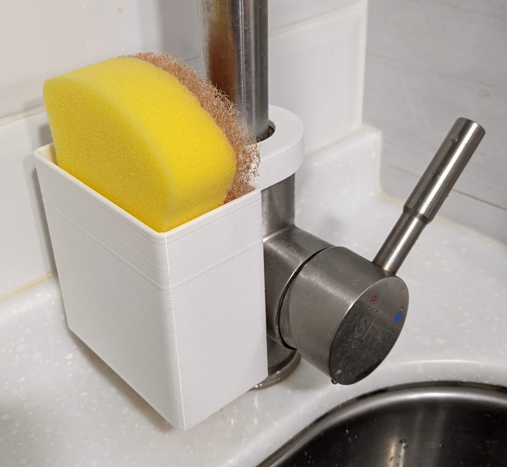
* Download: [Scrub_sponge_caddy_for_kitchen_faucets.stl](Scrub_sponge_caddy_for_kitchen_faucets.stl)
* Explain: Scrub Sponge Caddy for Kitchen Faucets

## Chessboard Paradox

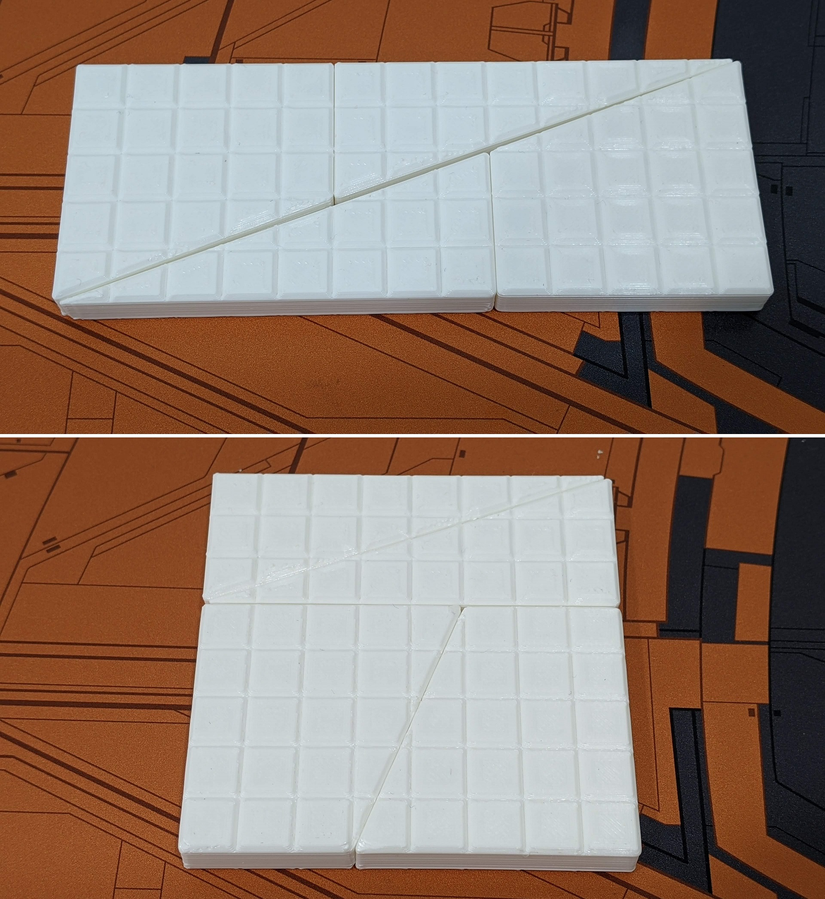 
* Download(Four-part assembly): [Chessboard_paradox.stl](Chessboard_paradox.stl)
* Download: [Chessboard_paradox_trapezoid.stl](Chessboard_paradox_trapezoid.stl)
* Download: [Chessboard_paradox_triangle.stl](Chessboard_paradox_triangle.stl)
* Explain: Chessboard paradox is a falsidical paradox based on an optical illusion. (Wiki: [https://en.wikipedia.org/wiki/Chessboard_paradox](https://en.wikipedia.org/wiki/Chessboard_paradox))

## IKEA Sucker kit

### Prototype hook
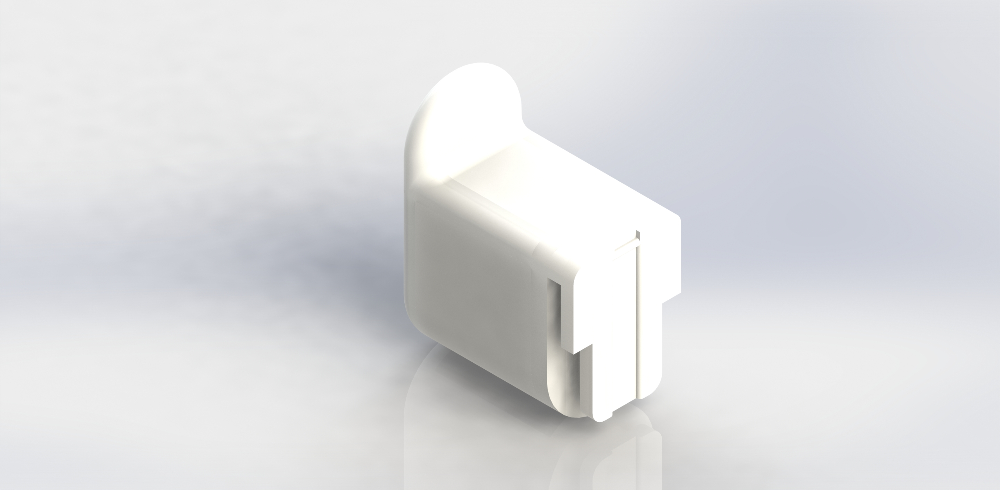 
* Download: [IKEA_Prototype_hook.stl](IKEA_Prototype_hook.stl)
* Explain: IKEA Prototype hook

### Scrub Sponge Caddy
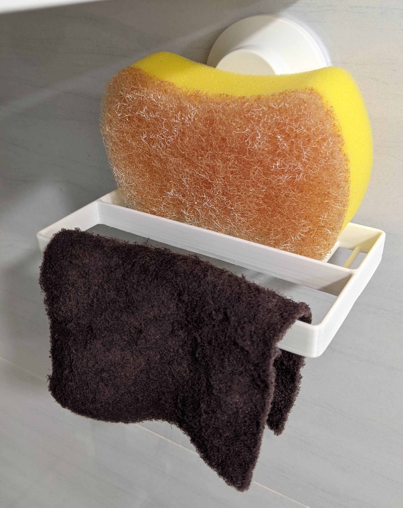 
* Download: [IKEA_Sponge_Caddy.stl](IKEA_Sponge_Caddy.stl)
* Explain: 2 in 1 Scrub Sponge Caddy

## Ender 3 v2 Cover

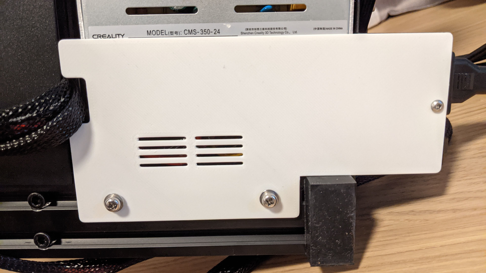 
* Download: [Ender_3_v2_cover.stl](Ender_3_v2_cover.stl)
* Explain: Better heat dissipation cover

## Piyopiyo Triangular Prism Toy

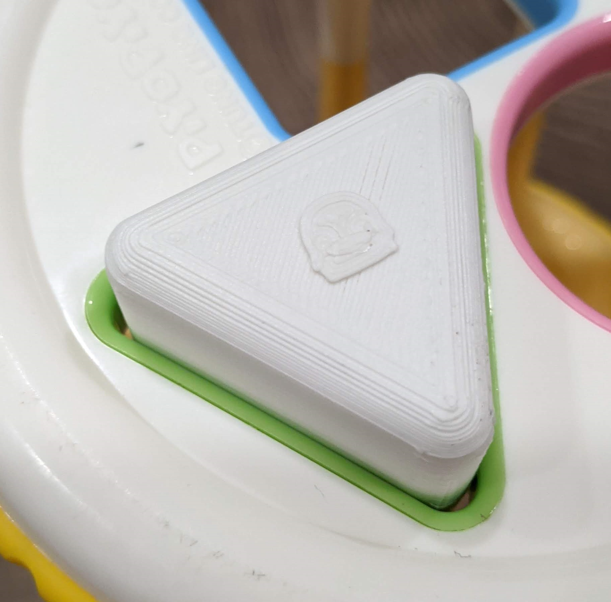 
* Download: [Piyopiyo_Triangular_Prism.stl](Piyopiyo_Triangular_Prism.stl)
* Explain: Piyopiyo Triangular Prism Toy

## XYZ Cube

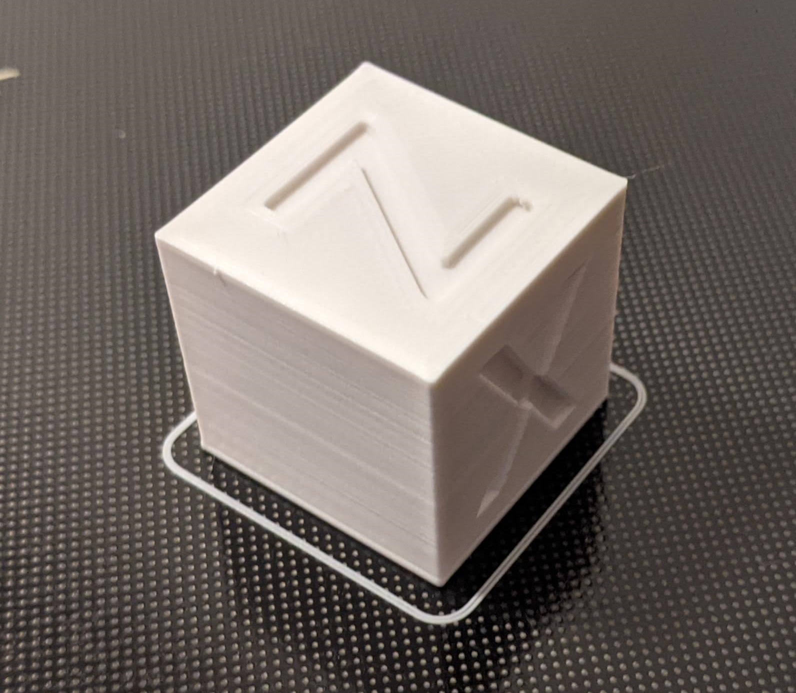 
* Download: [xyz.stl](xyz.stl)
* Explain: Calibration block

## Combi Baby Bottle Adapter Converter

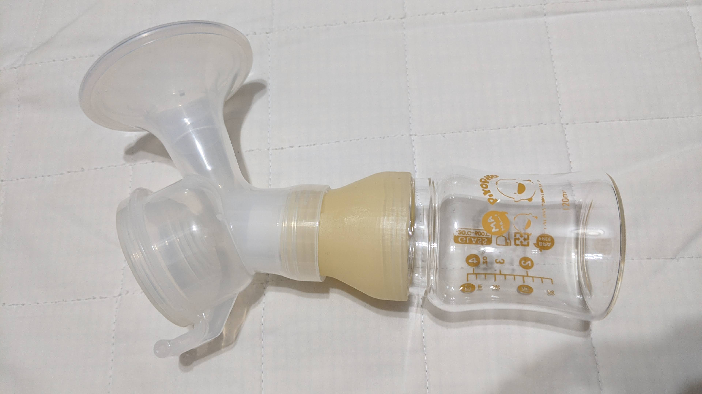 
* Download: [baby_bottle_adapter_converter.stl](baby_bottle_adapter_converter.stl)
* Explain: Bottle Adapter Converter From Combi Standard Neck To Wide Neck

## Magnetic Catch

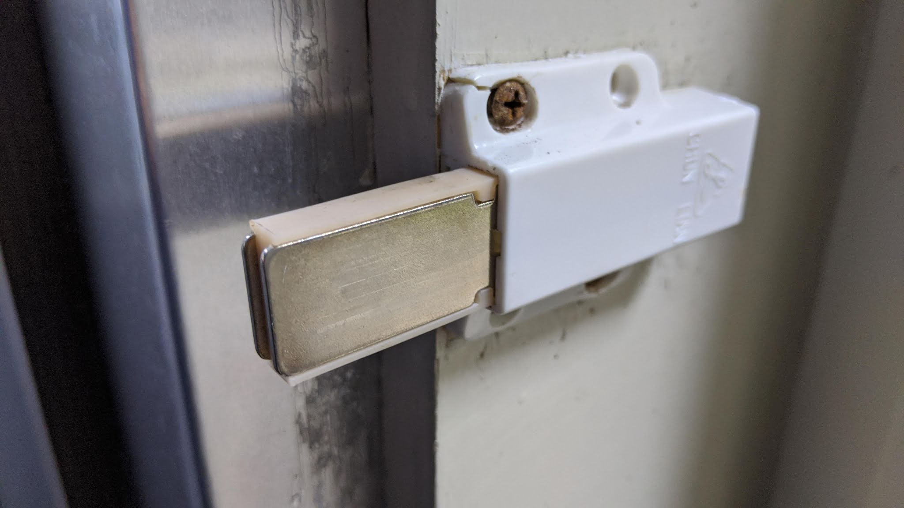 
* Download: [magnetic_catch.stl](magnetic_catch.stl)
* Article: [http://blog.qqboxy.com/2020/04/3d.html](http://blog.qqboxy.com/2020/04/3d.html)